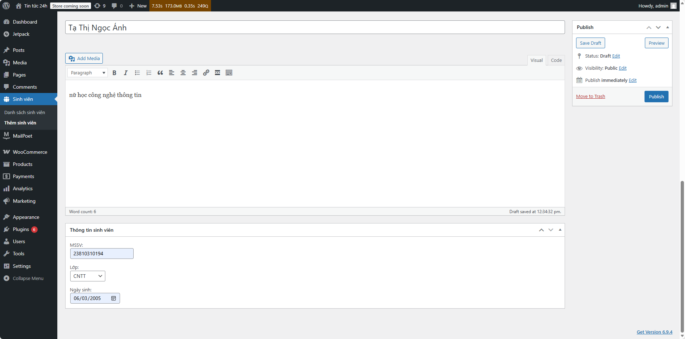
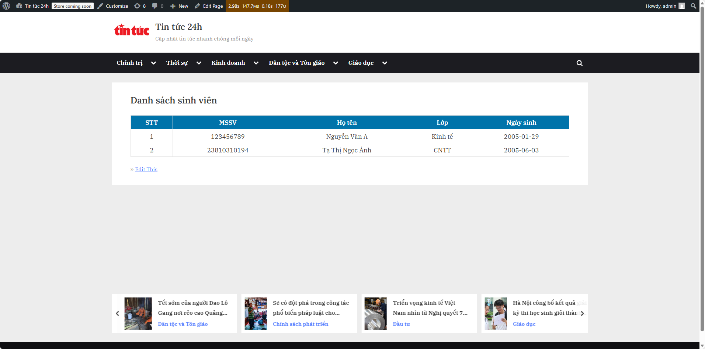

#  Student Manager Plugin

## Giới thiệu

**Student Manager** là một plugin WordPress giúp quản lý thông tin sinh viên.
Plugin cho phép nhập dữ liệu sinh viên trong trang quản trị (Backend) và hiển thị danh sách sinh viên ở giao diện người dùng (Frontend) thông qua shortcode.

---

## Chức năng chính

### Backend (Quản trị)

* Tạo **Custom Post Type: Sinh viên**
* Hỗ trợ:
  * Họ tên (title)
  * Tiểu sử/Ghi chú (editor)

* Thêm **Custom Meta Box**:
  * MSSV (text)
  * Lớp/Chuyên ngành (dropdown: CNTT, Kinh tế, Marketing)
  * Ngày sinh (date)

* Bảo mật dữ liệu:
  * Sử dụng **Nonce** chống CSRF
  * **Sanitize dữ liệu** trước khi lưu

---

### Frontend (Hiển thị)

* Shortcode:

```bash
[danh_sach_sinh_vien]
```

* Hiển thị danh sách sinh viên dạng bảng gồm:

  * STT
  * MSSV
  * Họ tên
  * Lớp
  * Ngày sinh

---

## Cấu trúc thư mục

```
student-manager/
│
├── student-manager.php
├── includes/
│   ├── cpt.php
│   ├── meta-box.php
│   ├── shortcode.php
│
├── assets/
│   └── style.css
```

---

## Hướng dẫn cài đặt

1. Copy thư mục `student-manager` vào:

```
wp-content/plugins/
```

2. Vào WordPress Admin:

* Plugins → Activate **Student Manager**

3. Sử dụng:

* Vào menu **Sinh viên → Thêm sinh viên** để thêm sinh viên
* Tạo Page và chèn shortcode:

```
[danh_sach_sinh_vien]
```

---

## Hình ảnh kết quả

### Backend


### Frontend

---

## Bảo mật

Plugin đảm bảo an toàn dữ liệu bằng:

* `wp_nonce_field()` → xác thực request
* `sanitize_text_field()` → làm sạch dữ liệu

---

## Công nghệ sử dụng

* WordPress Plugin API
* PHP
* HTML/CSS

---

## Output

* File `.zip` plugin
* Link Git repository
* File README.md (tài liệu này)

---

## Tác giả

* Name: Ngoc Anh
* Project: Student Manager Plugin
